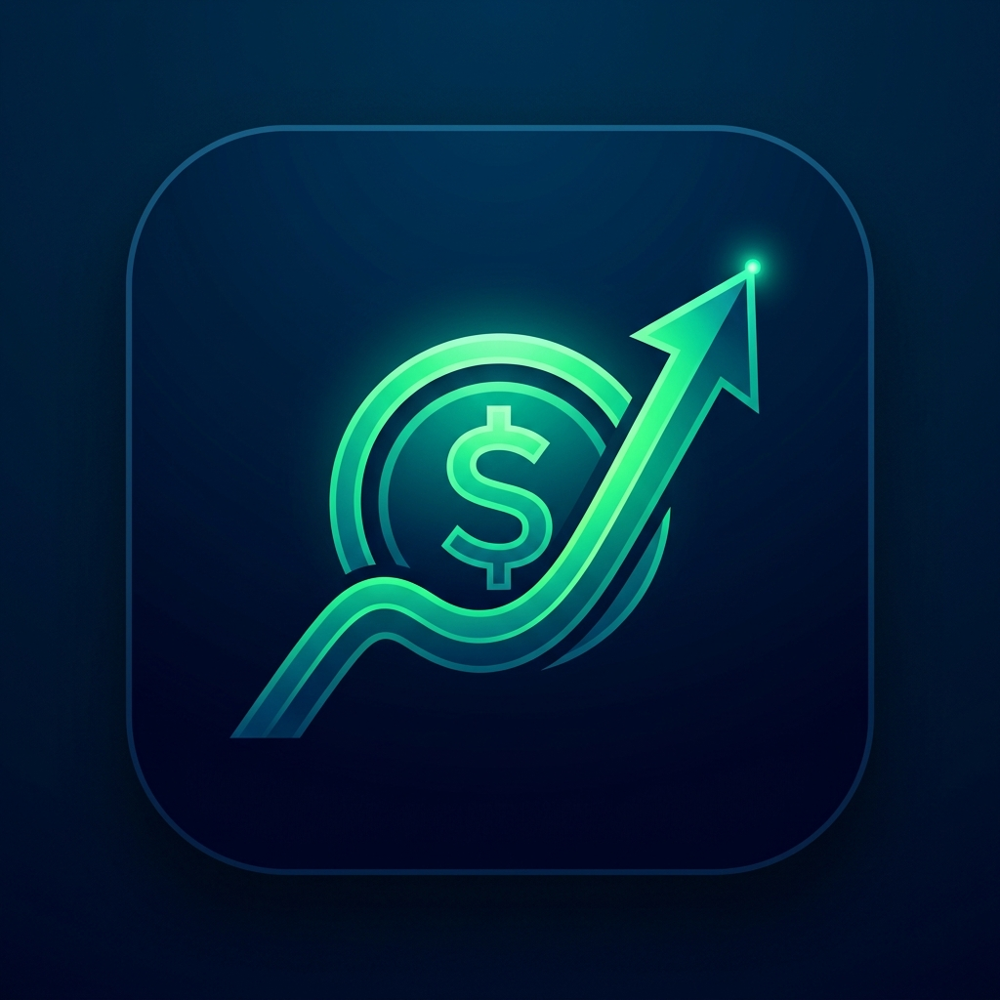

# Finanças 50/30/20 - PWA de Controle Financeiro Pessoal

Um aplicativo web Progressive Web App (PWA) de controle financeiro pessoal, focado em dispositivos móveis (*mobile-first*) e projetado para uso fácil com uma mão só. O aplicativo baseia-se na metodologia de orçamento **50/30/20** e funciona 100% offline.



## 🎯 Metodologia 50/30/20
O aplicativo divide automaticamente a sua **Renda Líquida Mensal** em três grandes metas:
* **50% para Necessidades:** Gastos essenciais como aluguel, contas básicas, alimentação, saúde e transporte.
* **30% para Desejos:** Gastos com estilo de vida, lazer, jantares, assinaturas de streaming e compras supérfluas.
* **20% para o Futuro:** Aportes para investimentos, poupança, reserva de emergência e quitação de dívidas.

---

## ✨ Funcionalidades
* **Dashboard Reativo:** Visualize o saldo mensal restante e o consumo de cada categoria do orçamento.
* **Barras de Progresso Dinâmicas:** As barras mudam de cor conforme o uso do limite de cada categoria:
  * **Verde (Até 70%):** Consumo seguro.
  * **Amarelo (70% a 90%):** Atenção ao limite.
  * **Vermelho (Acima de 90%):** Limite atingido ou estourado.
* **Inserção Rápida (FAB):** Botão flutuante posicionado para o alcance fácil do polegar. Abre um formulário nativo (`<dialog>`) limpo e rápido.
* **Extrato Interativo:** Delete despesas inseridas incorretamente e veja o saldo e barras recalculados na mesma hora.
* **Persistência Local:** Todos os dados são guardados de forma segura no navegador usando `localStorage` (sem necessidade de banco de dados ou login).
* **Instalação PWA Inteligente:** Prompt de instalação nativo ou instruções passo a passo dinâmicas de acordo com o navegador (Chrome, iOS Safari, Firefox, Opera, etc.).

---

## 🛠️ Tecnologias Utilizadas
* **HTML5** (Semântico, utilizando componentes nativos como `<dialog>` para modais e acessibilidade)
* **Tailwind CSS v4** (Estilização moderna com degradês e *glassmorphism*)
* **JavaScript Vanilla** (ES6+, sem frameworks pesados, garantindo performance máxima)
* **Service Workers & Cache API** (Para funcionamento completo sem conexão de internet)

---

## 🚀 Como Executar Localmente

Você precisará do [Node.js](https://nodejs.org/) instalado para rodar o servidor local.

1. Clone o repositório ou baixe os arquivos:
   ```bash
   git clone https://github.com/dnlPacheco/finance-pwa.git
   cd finance-pwa
   ```

2. Inicie um servidor local estático (ex: `http-server` via `npx`):
   ```bash
   npx http-server -p 8080
   ```

3. Abra a URL fornecida no seu navegador:
   * [http://localhost:8080](http://localhost:8080)

---

## 📱 Instalação no Celular (PWA)

O aplicativo detecta automaticamente o seu sistema operacional e navegador para guiar a instalação:

* **No Google Chrome / Edge / Opera (Android e Desktop):**
  Um banner aparecerá no topo do aplicativo. Basta clicar em **"Instalar Agora"** para adicioná-lo à tela inicial.
* **No Safari (iOS / iPhone):**
  O aplicativo exibirá um banner ensinando a clicar no botão de **Compartilhar** (seta para cima) e selecionar **"Adicionar à Tela de Início"**.
* **No Firefox / Outros Navegadores (Android):**
  Como estes navegadores não suportam o prompt automático de clique único, o banner mostrará uma instrução para abrir o menu do navegador (três pontos) e selecionar **"Adicionar à Tela Inicial"** ou **"Instalar"**.
